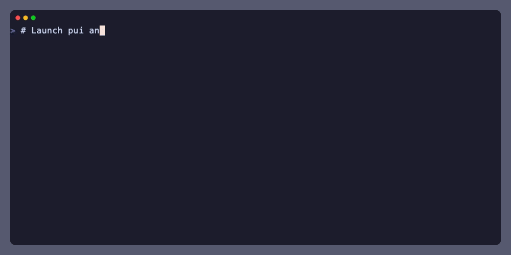

# Pui

A live, interactive terminal dashboard for tasks (ie: non-interactive background processes) managed by [Pueue](https://github.com/nukesor/pueue). Watch tasks run, stream their logs, filter and sort the task list, and run custom commands — all without leaving your terminal.



## Features

- **Real-time monitoring** — task statuses refresh automatically
- **Task management** — start, pause, kill, restart, and remove tasks
- **Streaming log viewer** — real-time log streaming with autoscroll
- **Task filtering** — interactive text filter across all columns (id, status, command, path)
- **Column sorting** — sort tasks by id, status, command, or path
- **Multi-select** — toggle selection on multiple tasks then apply actions to all selected tasks at once
- **Custom commands** — define key-bound commands that run in the selected task's working directory (e.g., launch lazygit, an editor, or shell)

## Pre-requisites

[Install Pueue](https://github.com/Nukesor/pueue#installation).

## Installation

Download the [latest Github release](https://github.com/tekumara/pui/releases/latest) manually, or using [eget](https://github.com/zyedidia/eget):

```bash
eget tekumara/pui
```

## Usage

Make sure the `pueued` daemon is running before starting `pui`.

Use `pueue` to create new tasks, and then `pui` to manage them.

To create a stashed task (ie: one that isn't started):

```bash
pueue add -s -- 'echo hello world'
```

To start pui:

```bash
pui
```

## Configuration

Pui is configured via a TOML file located at the platform-specific config directory:

| Platform    | Path                                                              |
| ----------- | ----------------------------------------------------------------- |
| Linux/macOS | `$XDG_CONFIG_HOME/pui/config.toml` or `~/.config/pui/config.toml` |
| Windows     | `%APPDATA%\pui\config.toml`                                       |

### Example

```toml
[custom_commands]
lazygit = { key = "g", cmd = ["lazygit"] }
editor = { key = "ctrl+e", cmd = ["nvim", "."] }
shell = { key = "alt+s", cmd = ["sh", "-c", "$SHELL"] }
```

### Custom Commands

Custom commands are key-bound commands that run in the selected task's working directory. Each command has:

- **key** — the key binding to trigger the command (e.g., `"g"`, `"ctrl+e"`, `"alt+r"`, `"opt+q"`)
- **cmd** — the command and arguments to run as an array (e.g., `["lazygit", "log"]`)
